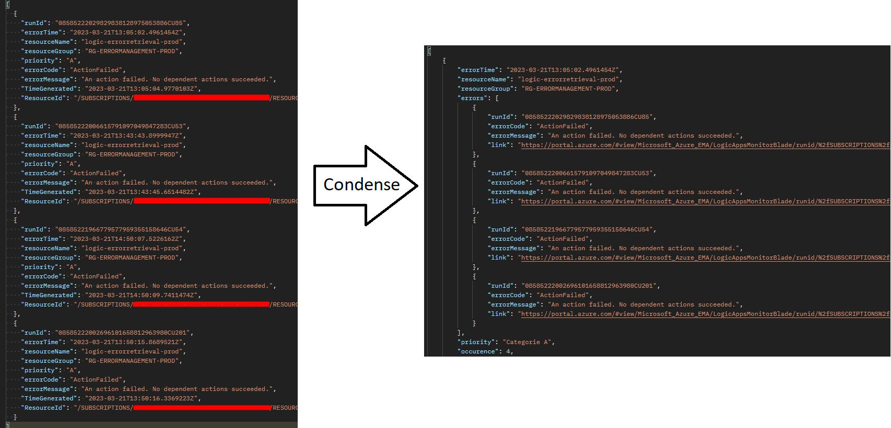

# Errormanagment implementatie
In dit korte rapport zijn de systemen en functionaliteiten van de verschillende systemen beschreven voor het project Alerting en Fouthandeling.

## Design Views
In de design views worden de verschillende systemen weergeven die gebruikt worden in dit project. De belangerijke systemen zijn met een kleur geïndentificeerd 

Implementaties met kleur:

- **Logic.ErrorExtraction** / Light Red  
De Logic App die de errors ophaalt en verwerkt en daarna doorstuurt
- **Logic.ErrorRetrieval** / Pink  
De Logic App die uiteindelijk de errors opvangt en naar de JIRA api stuurt
- **JIRA** / Light Gray  
De omgeving waar de gegevens terecht komen
- **AAD** / Light Orange  
De omgeving verantwoordelijk voor de veiligheid en token creatie
- **Log-emgmt-prod** / Light Blue  
De omgeving waar de errors vandaan worden gehaald
- **Apim-m10-prod** / Light Green  
Een API voor beveiliging van de motion10 omgeving
- **ErrorManagementAPI** / Dark Yellow  
De API die de request verwerkt en comprimeert
- **Stm10Errortimeprod** / Green  
De storage voor de laatste runtime van een extractie

Implementaties zonder kleur:

- **Logic.Error** / Logic App  
Een implementatie die expres fouten creëert 
- **ErrorInManagementChain** / Alert  
Een alert wanneer een extractie mislukt is
- **Errormanagementm10** / App Registry  
De verantwoordelijke voor de token creatie
- **ReadWriteClientApp** / App Registry  
De onderliggende rol in de token

### Proces View
In de activity diagram zie je het verloop en communicatie tussen de systemen. Dit gebeurt elke X minuten dat ingevuld is door Motion10

### Physical View
In de Physical view zijn de systemen te zien en op welke omgeving deze terecht horen te komen. Hierin zie je ook hoe met elkaar gecommuniceerd word.

### Development View
In de developmentview zijn de belangerijke systemen te zien met de onderliggende componenten die hierin gebruikt worden.

### Logical View
De API code is opgebouwd doormiddel van een clean-architectuur. Dit maakt de API gemakkelijk te beheren en uit te breiden. 

- **Core.Domain**  
De klassen waar de gegevens naartoe getransformeerd worden
- **Core.DomainService**  
De methode die de bovenliggende projecten moeten implementeren
- **ErrormanagementAPI**  
De API met de transformatie op de gegevens
- **Infrastructure.API**  
De infastructure die de gegevens stuurt naar de Logic.ErrorRetrieval. De connectie kan in Azure bij Connectionstrings worden ingevoerd naar de desbetreffende HTTP URL endpoint. 

- **Condense Methode**  
In de API bevind een Condense methode die de Log gegevens transformeert en overzet naar de klassen. De Condense methode geeft ook een Default waarde aan de prioriteit en een extra bericht in de beschrijving mocht de prioriteit nog niet bestaan. De link naar de implementatie die de error genereert word hierin ook gebundeld.

## Implementation
Voor het implementeren van het gehele systeem zijn er 2 straten ontwikkeld. 

- **Klantenimplementatie**  
Hierin zijn alle systemen die behoren tot de klantenimplementatie  

- **Motion10implementatie**
Hierin zijn alle systemen die behoren tot de klantenimplementatie  

Bij het deployen van deze implemenaties vinden verschillende parameters plaats die ingevuld moeten worden om de systemen met elkaar te verbinden. Denk hierbij aan:

- Clientcredentials
- API management Subscription Key
- Tokenendpoints